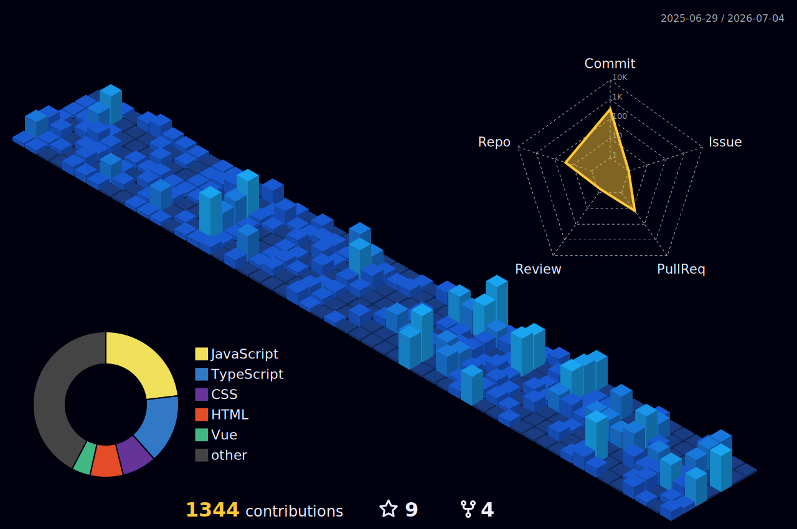

<div align="center">


<br><br>

[](https://git.io/typing-svg)

</div>

<br>

<div align="center">

<!-- Terminal Box dengan HTML biar bisa styling -->
<pre style="background:#1e1e2e;color:#cdd6f4;padding:20px;border-radius:10px;border:1px solid #cba6f7;display:inline-block;text-align:left;">

  <span style="color:#cba6f7;">$</span> <span style="color:#89b4fa;">whoami</span>                                              
  <span style="color:#a6e3a1;">> Bima Adam</span>                                           
                                                        
  <span style="color:#cba6f7;">$</span> <span style="color:#89b4fa;">cat</span> role.txt                                        
  <span style="color:#a6e3a1;">> Fullstack Developer · Founder @ IgnitronDev</span>         
                                                         
  <span style="color:#cba6f7;">$</span> <span style="color:#89b4fa;">echo</span> $STATUS                                        
  <span style="color:#f38ba8;">> Open to Remote / WFH</span> 🌏                             

</pre>

</div>





<div align="center">


</div>

---

```ts
const bima = {
  focus   : ["Backend Architecture", "System Design", "Scalable Infrastructure"],
  company : "IgnitronDev",
  building: "tools, applications, and experimental systems",
};
```

---

**`~/languages`**


**`~/frameworks`**


**`~/ui`**


&nbsp;


`~/devops`


**`~/other`**


&nbsp;


---

**`~/github`**

<div align="center">

[](https://github.com/bimaadam?tab=followers)
&nbsp;
[](https://github.com/bimaadam)
&nbsp;
[](https://github.com/bimaadam?tab=repositories)

</div>

---

<div align="center">

```bash
$ git log --oneline --all | tail -1
> "still learning. still building."
```

</div>
