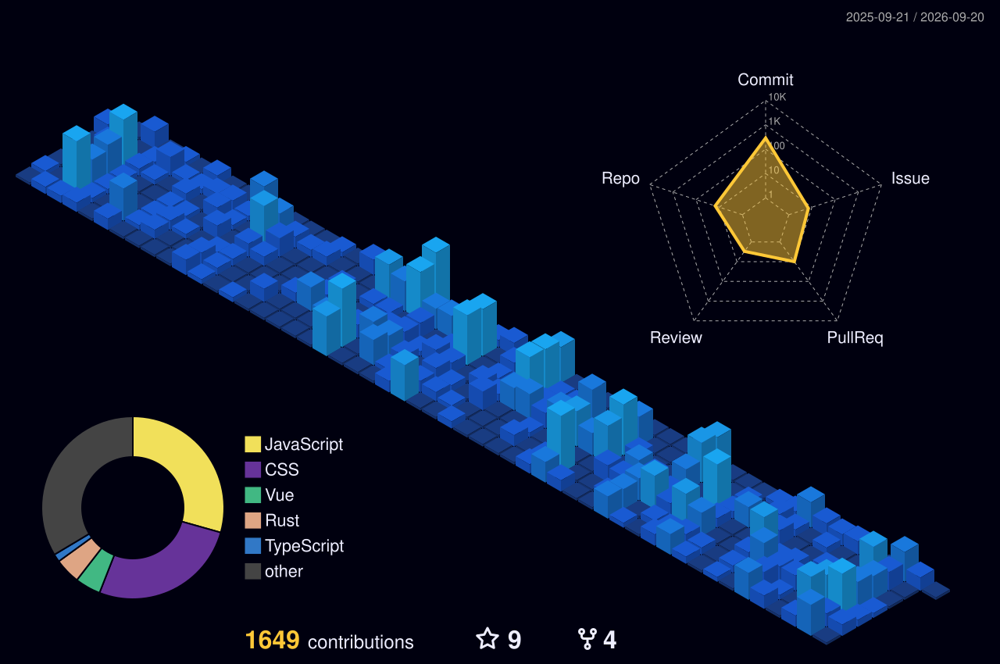

<div align="center">

[](https://git.io/typing-svg)

</div>

<div align="center">  </div>

<div align="center">

<br>

<!-- Status pills -->
<a href="#"></a>
<a href="#"></a>
<a href="#"></a>
<a href="#"></a>

</div>
<div align="center"></div>

<br>

<!-- ════════════ TERMINAL ════════════ -->
<div align="left">

<div style="max-width:620px;background:#181825;border:1px solid #313244;border-radius:12px;overflow:hidden;text-align:left;box-shadow:0 8px 24px rgba(0,0,0,0.4);">

  <!-- Title bar -->
  <div style="background:#11111b;padding:10px 16px;display:flex;align-items:center;gap:8px;">
    <span style="display:inline-block;width:12px;height:12px;border-radius:50%;background:#f38ba8;"></span>
    <span style="display:inline-block;width:12px;height:12px;border-radius:50%;background:#f9e2af;"></span>
    <span style="display:inline-block;width:12px;height:12px;border-radius:50%;background:#a6e3a1;"></span>
    <span style="margin-left:auto;color:#6c7086;font-family:monospace;font-size:12px;">bima@cloud-engineer: ~</span>
  </div>

  <!-- Terminal body -->
  <pre style="margin:0;padding:20px;background:#1e1e2e;color:#cdd6f4;font-family:JetBrains Mono,monospace;font-size:14px;line-height:1.6;">
<span style="color:#cba6f7;">$</span> <span style="color:#89b4fa;">whoami</span>
<span style="color:#a6e3a1;">> Bima Adam</span>

<span style="color:#cba6f7;">$</span> <span style="color:#89b4fa;">cat</span> target.txt
<span style="color:#a6e3a1;">> Cloud Engineer (in transition)</span>

<span style="color:#cba6f7;">$</span> <span style="color:#89b4fa;">cat</span> currently.txt
<span style="color:#f9e2af;">> Fullstack Engineer</span>

<span style="color:#cba6f7;">$</span> <span style="color:#89b4fa;">echo</span> $STATUS
<span style="color:#f38ba8;">> Open to Remote / WFH</span> 🌏
  </pre>

</div>

</div>

<br>

<!-- ════════════ 3D CONTRIBUTIONS ════════════ -->
<div align="left">



</div>

<br>

<!-- ════════════ STREAK ════════════ -->
<div align="center">


</div>

---

<!-- ════════════ ABOUT (CODE) ════════════ -->
<div align="left">

```ts
const bima = {
  target     : "Cloud Engineer (in transition)",
  focus      : ["AWS", "GCP", "Azure", "Infrastructure as Code"],
  currently  : "Fullstack Engineer",
  background : "3+ years Fullstack (TypeScript, NestJS, Next.js, React)",
};
```

</div>

---

<!-- ════════════ TECH STACK ════════════ -->
<div align="left">

**Cloud**
<br>


**DevOps**
<br>


**Languages**
<br>


**Frameworks**
<br>


**Mobile**
<br>


</div>

---

<!-- ════════════ GITHUB STATS ════════════ -->
<h3 align="left">
  
</h3>

<div align="left">

[](https://github.com/bimaadam?tab=followers)
[](https://github.com/bimaadam)
[](https://github.com/bimaadam?tab=repositories)

</div>

---

<!-- ════════════ TROPHY ════════════ -->
<div align="left">

<a href="https://github.com/ryo-ma/github-profile-trophy">
  
</a>

</div>

---

<!-- ════════════ FOOTER ════════════ -->
<div align="left">

```bash
$ git log --oneline --all | tail -1
> "still learning. still building."
```

<br>


</div>
